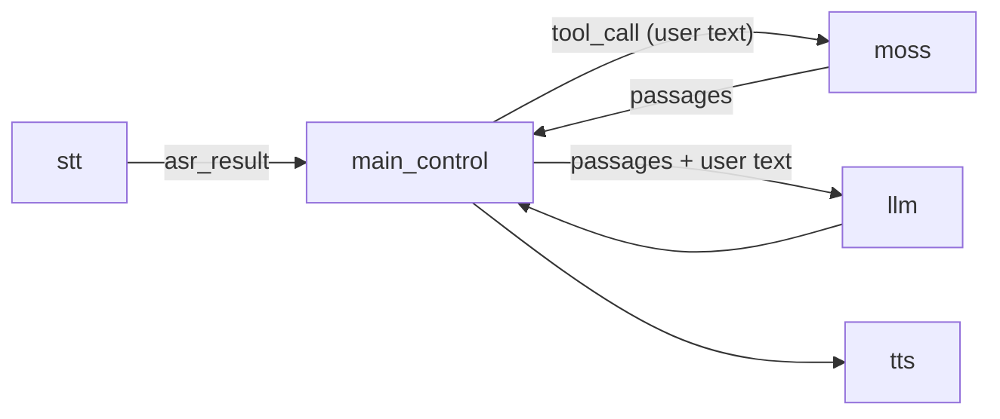
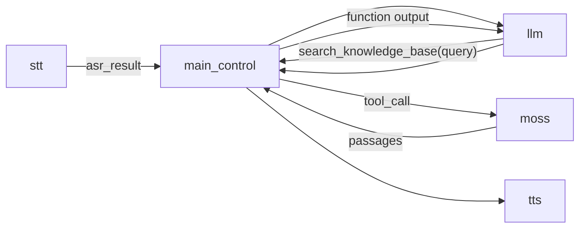

# Voice Assistant with Moss

The [voice-assistant](../voice-assistant) example, grounded in a [Moss](https://www.moss.dev)
knowledge base. The [moss_tool_python](../../ten_packages/extension/moss_tool_python) extension
loads a Moss index into memory when the agent starts, so each search takes a few milliseconds
and makes no network request.

| Graph | Retrieval | LLM calls per answer |
| --- | --- | --- |
| `moss_ambient` (default) | `main_control` searches on every final user turn | 1 |
| `moss_tool` | The LLM calls `search_knowledge_base` when it needs to | 2 when it searches |

## Ambient retrieval

`main_control` has `"context_tool": "search_knowledge_base"`. It keeps that tool away from the
LLM, calls it with each final transcript, and puts the passages before the user's words in
that turn. The transcript shown to the user does not change.

## Tool call

`main_control` has no `context_tool`, so the tool reaches the LLM like any other.

## Run it

1. In the [Moss portal](https://portal.usemoss.dev), create a project and an index from your
   documents.
2. In `ai_agents/.env`, set `MOSS_PROJECT_ID`, `MOSS_PROJECT_KEY` and `MOSS_INDEX_NAME`, plus
   `AGORA_APP_ID`, `DEEPGRAM_API_KEY`, `OPENAI_API_KEY`, `OPENAI_MODEL` and `ELEVENLABS_TTS_KEY`.
3. In this directory, run `task install`, then `task run`.
4. Open http://localhost:3000, pick `moss_ambient` or `moss_tool`, and ask about your documents.

The `moss` node settings are described in the
[extension README](../../ten_packages/extension/moss_tool_python/README.md).
